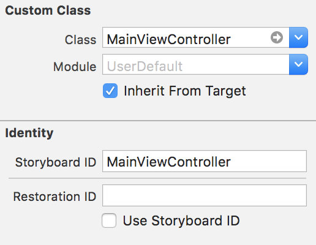

# 5월 30일
## 오전 리뷰
>### 오토레이아웃 팁

- 1. 오토레이아웃 순서대로 생각
- 2. 추측은 안하는것이 좋음..(왜 되는거지??<---위험)


## 오전 수업

>## UserDefault

- 데이터 저장 방법
	- 파일저장(Property List, SQLite, 아카이빙)
	- iOS DataBase 이용 - Core Data
	- Network - Server DB 이용

- UserDefault(Property List 이용)
	- 사용자의 정보를 저장하는 싱글톤 인스턴스
	- 내부적으로 plist 파일로 저장되어 보안이 강하지 않다(필요에 따라 암호화 필요함)
	- 주요항목

```
open class var standard: UserDefaults { get }

//데이터 불러오기

open func object(forKey defaultName: String) -> Any?
open func string(forKey defaultName: String) -> String?
open func array(forKey defaultName: String) -> [Any]?

//데이터 저장하기
open func set(_ value: Any?, forKey defaultName: String)

//데이터 지우기
open func removeObject(forKey defaultName: String)
```


- UserDefault 예제

```
//*key값은 통일 시켜야 한다.

//데이터 저장
UserDefaults.standard.set("joo", forKey: "userID")

//데이터 불러오기
let aUser:String = UserDefaults.standard.object(forKey: "UserID") as! String
let sUser:String = UserDefaults.standard.string(forKey: "UserID")!

```


## 오후 수업
>### UIViewController

- 앱의 기초가 되는 내부구조
- 모든앱은 적어도 한개 이상의 viewController 를 가지고 있으며 대부분의 앱은 여러개의 viewController	로 이루어져 있다.
- viewController	는 사용자의 인터렉션과 앱의 데이터 사이에서 컨트롤의 역할을 한다.
- View관리, 사용자 이벤트 핸들링, ViewController 간의 전환 등을 위한 메소드와 프로퍼티를 가지고 있다.

>### UIViewController - Root View

-
>### ViewController 특징

-
>### Child UIViewController

-  viewController는 다른 viewController를 child viewController로 Container의 역할을 수행한다.
-  Child ViewController의 RootView를 자신의 RootView에 addSubView하여 화면에 표시한다.


>### UserInteraction

-
>### Data Marshaling(중계자)

- ViewController는 자신이 관리하는 View들과 앱 내부의 데이터와의 중계자 역할을 한다.

>### Resource Management

- ViewController안에 있는 모든 View나 Object는 모두 ViewController의 책임이다.
- 메모리가 부족시 didReceiveMemoryWarning() 메소드가 자동 으로 불리며, 오래동안 사용하지 않은 객체와 다시 쉽게 만들수 있는 객체를 제거할수 있어 메모리를 효율적으로 관리한다.


>### ViewController 종류

```
- General View Controller
	- 일반적인 View Controller형태
	- 각 View Controller가 Root View를 가지고 있다.
		- UIViewController
		- UITableViewController
		- UICollectionViewController

- Container View Controller
	- UINavigationController
	- UITabbarController
	- UISplitViewController
```


>### UIViewController Instance Load

```
class AppDelegate: UIResponder, UIApplicationDelegate {

    var window: UIWindow?


    func application(_ application: UIApplication, didFinishLaunchingWithOptions launchOptions: [UIApplicationLaunchOptionsKey: Any]?) -> Bool {

        self.window = UIWindow(frame: UIScreen.main.bounds)

        let storyboard:UIStoryboard = UIStoryboard(name: "Main", bundle : nil)
        let viewController:MainViewController = storyboard.instantiateViewController(withIdentifier: "MainViewController") as! MainViewController


        self.window?.rootViewController = viewController
        self.window?.makeKeyAndVisible()

        return true
    }

```



>### 화면전환(Present Modally)

- ViewController간의 화면 전환


>### Segue

```
- 앱의 인터페이스 흐름을 정의하는데 사용
- StoryBoard 파일 내 두 개의 ViewController사이의 화면전환을 정의
- Segue의 시작점은 button, tableView의 row, gesture등으로 시작하며 끝점은 전환되는 다음 ViewController 이다.
- segue는 일반적으로 다음 ViewController로 진행되는 것을 가르키나, unwind segue를 통해 ViewController를 닫는(close) 역할도 할수 있다.
```


>### Modifying a Segue's Behavior at Runtime

```
- shouldPerformSegueWithIdentifier:sender:
- prepareForSegue:sender:
```

>### Unwind Segue

- 되돌아갈 ViewController선택
- 선택된 ViewController에 다음 메소드 정의
-
